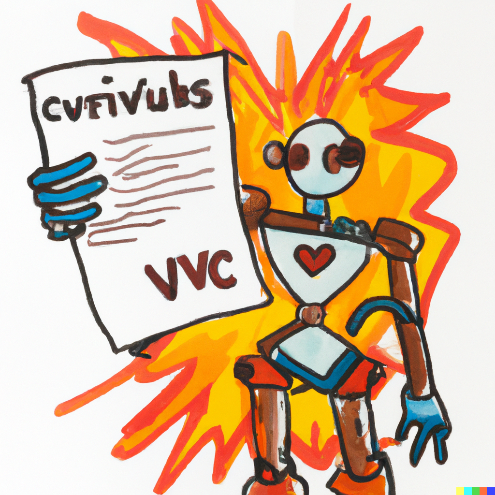

<p align="center">
    
</p>
<div align="center">
    <font><em>Courtesy of DALL·E.</em></font>
</div>

## CVBIA

Create CVs in PDF and PPT formats from YAML input.

## Development Setup

This setup is for those that wish to develop CVBIA. All other users should access the [webapp](https://cv-bia.streamlit.app/).

1. Clone this repo to your machine and setup your local virtual environment:

    ```bash
    git clone git@github.com:godatadriven/cvbia.git
    cd cvbia
    python -m virtualenv .venv
    source .venv/bin/activate
    pip install -r requirements.txt
    pre-commit install
    ```

1. Edit `cv_data.yaml` to include your details.

1. Run Streamlit locally:

    ```bash
    streamlit run streamlit_app.py
    ```

1. Access the provided URL, upload your headshot and download your CV 🎉!
